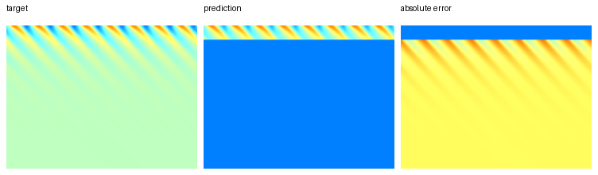

# PDEBench + NeuralOperator FNO Reproduction

Portfolio-oriented reproduction project for **PDEBench 1D Burgers** using a **Fourier Neural Operator (FNO)** from [NeuralOperator](https://neuraloperator.github.io/dev/).

The goal is to show a complete AI-for-engineering workflow: PDEBench HDF5 data loading, autoregressive PDE rollout, NeuralOperator model integration, metric reporting, and prediction visualization. The included result is a small real-data development verification run, not a full benchmark claim.



## Current Result

The checked-in result uses a small Burgers development file to verify the full training and evaluation pipeline.

| Run | Data | Epochs | MSE | RMSE | Relative L2 |
| --- | --- | ---: | ---: | ---: | ---: |
| `burgers_fno_neuralop_development` | 32 samples from a small real HDF5 file | 1 | 0.19397 | 0.41578 | 0.90613 |

Interpretation: this run confirms the engineering pipeline works end to end. The error is still high because it is a one-epoch development run, so it should not be presented as a full PDEBench reproduction score.

## What This Project Includes

- NeuralOperator `FNO` backend for 1D Burgers forecasting.
- PDEBench-style HDF5 reader supporting `tensor`, `x-coordinate`, and `t-coordinate` files.
- Autoregressive rollout from the first `initial_step` frames to future frames.
- MSE, RMSE, and relative L2 metrics over predicted frames.
- Reproducible YAML configs for full data, real-data development, and synthetic smoke tests.
- Resumable downloader for the official PDEBench Burgers file.

## Environment

Use the project conda environment directly on Windows:

```powershell
& "C:\Project\anaconda3\envs\torch_cuda\python.exe" -m py_compile run_burgers_fno.py scripts\download_pdebench.py
```

Required packages:

```text
torch
neuraloperator
h5py
numpy
pyyaml
tqdm
pillow
requests
```

## Data

The full official PDEBench Burgers file is **8.23GB** and is not committed to this repository.

Download the full file from the Hugging Face PDEBench mirror:

```powershell
& "C:\Project\anaconda3\envs\torch_cuda\python.exe" scripts\download_pdebench.py --name burgers_nu001_hf --output-dir data
```

Download the small real-data development file used for the included result:

```powershell
& "C:\Project\anaconda3\envs\torch_cuda\python.exe" scripts\download_pdebench.py --name burgers_nu001_development --output-dir data
```

The downloader writes incomplete downloads as `.part` files and resumes them on the next run.

## Run

Full NeuralOperator reproduction config:

```powershell
& "C:\Project\anaconda3\envs\torch_cuda\python.exe" run_burgers_fno.py --config configs\burgers_fno_neuralop.yaml
```

Small real-data development verification:

```powershell
& "C:\Project\anaconda3\envs\torch_cuda\python.exe" run_burgers_fno.py --config configs\burgers_fno_neuralop_development.yaml
```

Synthetic smoke test for quick code validation:

```powershell
& "C:\Project\anaconda3\envs\torch_cuda\python.exe" run_burgers_fno.py --config configs\smoke_synthetic_neuralop.yaml
```

Each run writes metrics and a visualization under `outputs/<run_name>/`.

## Repository Notes

- Data files and model checkpoints are intentionally excluded from Git.
- The committed visualization and metrics are small artifacts for portfolio review.
- See [REPRODUCTION.md](REPRODUCTION.md) for the reproduction boundary, current validation status, and next steps.

## Sources

- PDEBench repository: https://github.com/pdebench/PDEBench
- PDEBench dataset DOI: https://doi.org/10.18419/darus-2986
- NeuralOperator documentation: https://neuraloperator.github.io/dev/
